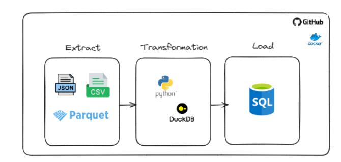
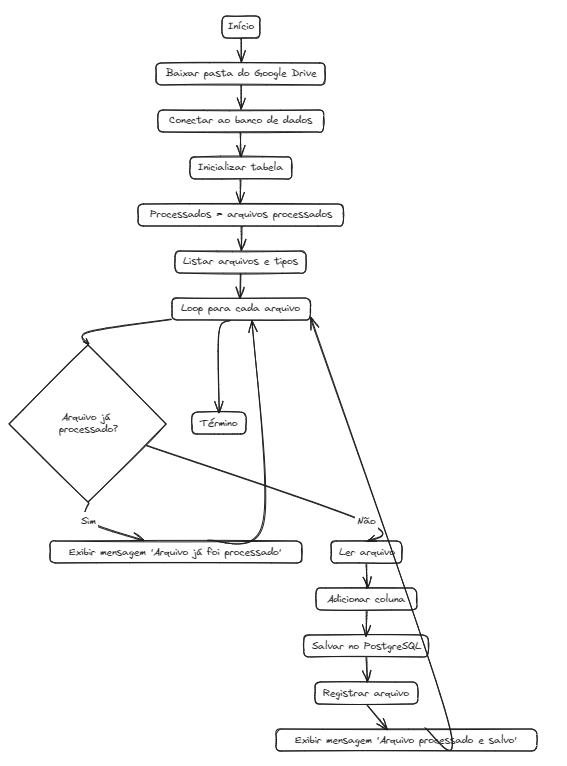

#  ETL with DuckDB

Esse é um projeto que lê um desses arquivos: CSV, JSON e PARQUET, do google drive faz transformações com Python e com o DuckDB e carrega os dados em um banco PostegreSQL.

# DEPLOYS

O banco PostegreSQL foi hospedado na nuvem Render, onde você pode fazer deploys de forma rápido e fácil e qualquer um consegue se conectar ao servidor do banco.

Foi realizado também o deploy de uma página na web utilizando Streamlit, através do Render, onde o usuário pode executar o ETL com apenas um clique, conforme imagem abaixo:

# WHY USE IT

Então, caso um usuário tenha uma rotina para processar um arquivo diariamente, ou até de hora em hora, ele pode inserir o arquivo na pasta do drive, e clicar em "Processador" na página WEB, isso dispara o ETL. Posteriormente, o usuário consegue consultar os dados transformados direto no banco de dados.

# ETL ARCHITECTURE

# MORE ABOUT DUCKDB

Em resumo, DuckDB é uma escolha atraente para projetos que exigem alto desempenho, eficiência de memória e facilidade de integração, especialmente em ambientes com grandes volumes de dados ou restrições de memória. Ele oferece suporte a SQL completo e pode ser usado para uma ampla variedade de aplicativos, desde análise de dados até desenvolvimento de aplicativos.

- Desempenho: DuckDB é conhecido por seu desempenho excepcional em consultas analíticas e operações de processamento de dados. Ele foi otimizado para trabalhar eficientemente com grandes conjuntos de dados, o que o torna uma escolha atraente para projetos que lidam com grandes volumes de dados.

- Eficiência de Memória: DuckDB foi projetado para ser eficiente em termos de uso de memória. Ele pode lidar com conjuntos de dados que não cabem na memória, processando-os de forma eficiente em disco. Isso o torna uma opção viável para projetos em ambientes com restrições de memória.

- Facilidade de Integração: DuckDB oferece uma interface fácil de usar que permite integrá-lo facilmente em aplicativos Python e outras linguagens de programação. Ele pode ser usado como um banco de dados embutido em aplicativos ou como um servidor independente, dependendo dos requisitos do projeto.

- Suporte a SQL Completo: DuckDB oferece suporte a uma ampla gama de recursos SQL, incluindo operações de junção, agregação, subconsultas e muito mais. Ele também suporta funções analíticas avançadas, o que o torna uma escolha poderosa para análise de dados.

- Licença de Código Aberto: DuckDB é distribuído sob a licença de código aberto MIT, o que significa que é livre para uso, modificação e distribuição, mesmo em aplicativos comerciais. Isso o torna uma escolha atraente para empresas e organizações que buscam uma solução de banco de dados robusta e econômica.

Você pode saber mais através de sua documentação no link, clicando em [saiba mais.](https://duckdb.org/docs/api/python/reference/)